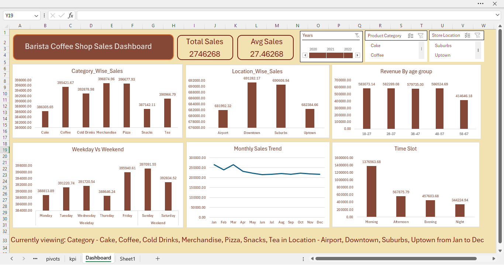
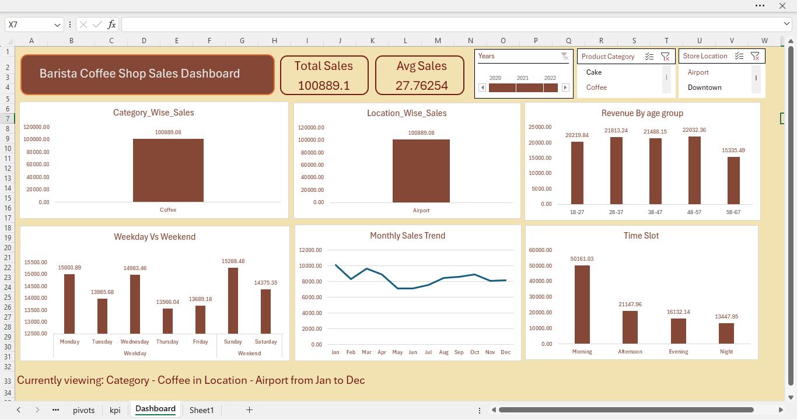

# ☕ Barista Coffee Shop Sales Dashboard

An Excel-based interactive dashboard built to analyze sales data for barista coffee shop chain. This project simulates a real-world scenario where a business analyst would deliver key insights on sales performance, location trends, customer behavior, and time-based sales.

Built using PivotTables, Slicers, Timeline filters, and advanced formulas — this dashboard highlights my Excel skills tailored for data-driven decision-making

---

## 🔍 Project Objective

To help the business answer critical questions such as:

- Which product categories are top-performing?
- How do different store locations compare in sales?
- What time slots generate the most revenue?
- Are weekdays or weekends more profitable?
- How do sales trends look across months?

---

## 📊 Key Features

- 📦 **Category-wise Sales Analysis**
- 📍 **Location-wise Revenue Comparison**
- 👥 **Revenue by Customer Age Group**
- 🕒 **Time Slot-wise Performance**
- 📈 **Monthly Sales Trend**
- 📅 **Weekday vs Weekend Insights**
- 📌 **Dynamic KPI Tiles**: Total Sales, Average Sales
- ✍️ **Auto-updating summary text**:
  > “Currently viewing: Coffee, Snacks in Suburb from January to December”

---

## 🧠 Tools & Techniques Used

- Microsoft Excel
- Pivot Tables & Pivot Charts
- Slicers and Timeline Filters
- Dashboard layout & formatting best practices

---

## 📂 Dataset

Dataset used:  
📥 [Barista Coffee Sales Data – Kaggle](https://www.kaggle.com/datasets/yashparab/barista-coffee-sales-data-for-eda-csv/data)

Fields include:
- Order Date
- Product Category
- Store Location
- Quantity Sold
- Revenue
- Customer Age Group
- Time Slot

---

## 🖥️ Live View (Excel Online – View Only)

You can interact with the dashboard in Excel Online without downloading:

🔗 [View Dashboard on OneDrive (View-Only)](https://1drv.ms/x/c/2fe0523cd439b7b6/EXNTVkNoohBOjJVrd6t-W7ABIzlJg4t8DuQI7F90BvKMkw?e=3Sndva)

---

## 📷 Dashboard Preview

### 🔹 Default View (All Categories & Locations)

---

### 🔸 Filtered View (Example: Coffee in Airport – 2022)

The dashboard updates dynamically when slicers are used.  
Below is an example of how the layout and charts adapt to selected filters:

- **Category:** Coffee
- **Store Location:** Airport

📝 _“Currently viewing: Coffee in Airport from Jan to Dec”_

---

## 🙋‍♂️ About Me

**Kanishka Narayan Choudhury**  
Aspiring Data Analyst | Excel | SQL | Power BI | Python  
🔗 [LinkedIn Profile](https://www.linkedin.com/in/kanishka-n-choudhury/)

---

